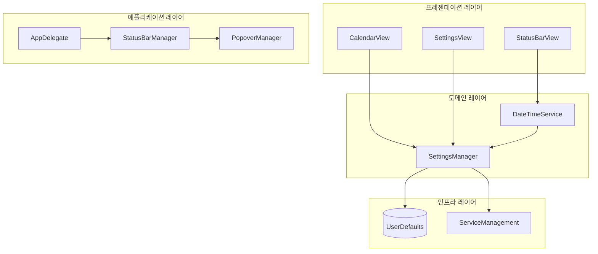
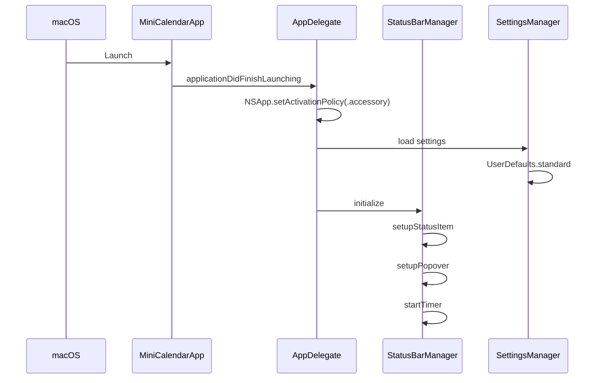
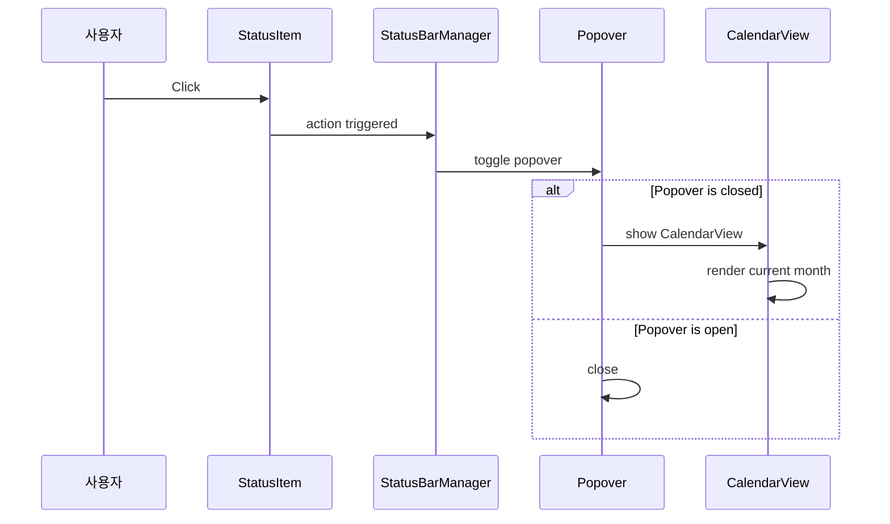

# 설계 문서

## 개요

MiniCalendar는 macOS 메뉴 막대에서 실행되는 네이티브 Swift 애플리케이션입니다. NSStatusItem을 사용하여 메뉴 막대에 날짜/시간을 표시하고, NSPopover를 통해 달력 팝업을 제공합니다. SwiftUI를 주요 UI 프레임워크로 사용하며, AppKit과의 통합을 통해 메뉴 막대 기능을 구현합니다.

## 아키텍처

### 전체 구조

```
┌─────────────────────────────────────────────────────────────┐
│                        MiniCalendar App                      │
├─────────────────────────────────────────────────────────────┤
│  ┌─────────────┐  ┌─────────────┐  ┌─────────────────────┐  │
│  │   AppKit    │  │   SwiftUI   │  │    Foundation       │  │
│  │  Integration│  │    Views    │  │     Services        │  │
│  ├─────────────┤  ├─────────────┤  ├─────────────────────┤  │
│  │ AppDelegate │  │ CalendarView│  │ SettingsManager     │  │
│  │ StatusBar   │  │ SettingsView│  │ DateTimeService     │  │
│  │ Manager     │  │ PopoverView │  │ LaunchAtLogin       │  │
│  └─────────────┘  └─────────────┘  └─────────────────────┘  │
└─────────────────────────────────────────────────────────────┘
```

### 레이어 구조



## 컴포넌트 및 인터페이스

### 1. AppDelegate

앱의 생명주기를 관리하고 메뉴 막대 앱으로 설정합니다.

```swift
// AppDelegate.swift
import Cocoa
import SwiftUI

class AppDelegate: NSObject, NSApplicationDelegate {
    private var statusBarManager: StatusBarManager?

    func applicationDidFinishLaunching(_ notification: Notification) {
        // Dock 아이콘 숨기기
        NSApp.setActivationPolicy(.accessory)

        // 상태 바 매니저 초기화
        statusBarManager = StatusBarManager()
    }

    func applicationWillTerminate(_ notification: Notification) {
        // 설정 저장
        SettingsManager.shared.save()
    }
}
```

### 2. StatusBarManager

메뉴 막대 아이템과 팝오버를 관리합니다.

```swift
// StatusBarManager.swift
import AppKit
import SwiftUI

class StatusBarManager: ObservableObject {
    private var statusItem: NSStatusItem?
    private var popover: NSPopover?
    private var dateTimeService: DateTimeService
    private var timer: Timer?

    init() {
        setupStatusItem()
        setupPopover()
        startTimer()
    }

    // 메뉴 막대 아이템 설정
    func setupStatusItem() { ... }

    // 팝오버 설정
    func setupPopover() { ... }

    // 타이머 시작 (시간 업데이트용)
    func startTimer() { ... }

    // 메뉴 막대 텍스트 업데이트
    func updateStatusBarText() { ... }

    // 팝오버 토글
    func togglePopover() { ... }
}
```

### 3. SettingsManager

앱 설정을 관리하고 UserDefaults에 저장합니다.

```swift
// SettingsManager.swift
import Foundation
import ServiceManagement

class SettingsManager: ObservableObject {
    static let shared = SettingsManager()

    // 일반 설정
    @Published var openAtLogin: Bool
    @Published var classicAppearance: Bool
    @Published var showOnlyIcon: Bool

    // 시간 옵션
    @Published var showTime: Bool
    @Published var showSeconds: Bool
    @Published var use24HourClock: Bool
    @Published var showAMPM: Bool

    // 날짜 옵션
    @Published var showDayOfWeek: Bool
    @Published var showDate: Bool
    @Published var dateFormat: String

    // 달력 옵션
    @Published var weekStartsOnMonday: Bool

    // UserDefaults에서 로드/저장
    func load() { ... }
    func save() { ... }

    // 로그인 시 실행 설정
    func setLaunchAtLogin(_ enabled: Bool) { ... }
}
```

### 4. DateTimeService

현재 날짜/시간 포맷팅을 담당합니다.

```swift
// DateTimeService.swift
import Foundation

class DateTimeService: ObservableObject {
    private let settingsManager: SettingsManager

    @Published var formattedDateTime: String = ""

    init(settingsManager: SettingsManager) {
        self.settingsManager = settingsManager
    }

    // 설정에 따른 날짜/시간 문자열 생성
    func getFormattedDateTime() -> String { ... }

    // 날짜 포맷터 생성
    private func createDateFormatter() -> DateFormatter { ... }
}
```

### 5. CalendarView (SwiftUI)

월간 달력을 표시하는 메인 뷰입니다.

```swift
// CalendarView.swift
import SwiftUI

struct CalendarView: View {
    @ObservedObject var settingsManager: SettingsManager
    @State private var displayedMonth: Date = Date()

    var body: some View {
        VStack {
            // 헤더 (년/월, 네비게이션)
            CalendarHeaderView(...)

            // 요일 행
            WeekdayHeaderView(...)

            // 날짜 그리드
            CalendarGridView(...)
        }
    }
}
```

### 6. SettingsView (SwiftUI)

설정 화면을 표시합니다.

```swift
// SettingsView.swift
import SwiftUI

struct SettingsView: View {
    @ObservedObject var settingsManager: SettingsManager

    var body: some View {
        Form {
            // 일반 섹션
            Section("General") { ... }

            // 시간 옵션 섹션
            Section("Time options") { ... }

            // 날짜 옵션 섹션
            Section("Date options") { ... }

            // 달력 옵션 섹션
            Section("Calendar options") { ... }

            // 하단 버튼
            HStack {
                Button("Quit") { ... }
            }
        }
    }
}
```

## 데이터 모델

### Settings 모델

```swift
// Settings.swift
struct Settings: Codable {
    // 일반 설정
    var openAtLogin: Bool = false
    var classicAppearance: Bool = false
    var showOnlyIcon: Bool = false

    // 시간 옵션
    var showTime: Bool = true
    var showSeconds: Bool = false
    var use24HourClock: Bool = true
    var showAMPM: Bool = false

    // 날짜 옵션
    var showDayOfWeek: Bool = true
    var showDate: Bool = true
    var dateFormat: String = "M월 d일"

    // 달력 옵션
    var weekStartsOnMonday: Bool = false

    // UserDefaults 키
    static let userDefaultsKey = "MiniCalendarSettings"
}
```

### CalendarDay 모델

```swift
// CalendarDay.swift
struct CalendarDay: Identifiable {
    let id = UUID()
    let date: Date
    let isCurrentMonth: Bool
    let isToday: Bool
}
```

## 파일 구조

```
MiniCalendar/
├── MiniCalendarApp.swift          # 앱 진입점
├── AppDelegate.swift              # 앱 생명주기 관리
├── Info.plist                     # 앱 설정 (LSUIElement 등)
│
├── Managers/
│   ├── StatusBarManager.swift     # 메뉴 막대 관리
│   └── SettingsManager.swift      # 설정 관리
│
├── Services/
│   └── DateTimeService.swift      # 날짜/시간 포맷팅
│
├── Models/
│   ├── Settings.swift             # 설정 데이터 모델
│   └── CalendarDay.swift          # 달력 날짜 모델
│
├── Views/
│   ├── PopoverView.swift          # 팝오버 컨테이너
│   ├── CalendarView.swift         # 달력 메인 뷰
│   ├── CalendarHeaderView.swift   # 달력 헤더 (년/월)
│   ├── WeekdayHeaderView.swift    # 요일 헤더
│   ├── CalendarGridView.swift     # 날짜 그리드
│   ├── DayCell.swift              # 개별 날짜 셀
│   └── SettingsView.swift         # 설정 화면
│
├── Extensions/
│   ├── Date+Extensions.swift      # Date 확장
│   └── Color+Extensions.swift     # Color 확장
│
└── Assets.xcassets/
    └── AppIcon.appiconset/        # 앱 아이콘
```

## 핵심 동작 흐름

### 앱 시작 흐름



### 팝오버 표시 흐름



## 에러 처리

### 1. 설정 로드/저장 실패

```swift
// SettingsManager.swift
func load() {
    do {
        if let data = UserDefaults.standard.data(forKey: Settings.userDefaultsKey) {
            settings = try JSONDecoder().decode(Settings.self, from: data)
        }
    } catch {
        // 기본값 사용
        settings = Settings()
        print("Failed to load settings: \(error)")
    }
}
```

### 2. 로그인 시 실행 설정 실패

```swift
// SettingsManager.swift
func setLaunchAtLogin(_ enabled: Bool) {
    do {
        if enabled {
            try SMAppService.mainApp.register()
        } else {
            try SMAppService.mainApp.unregister()
        }
    } catch {
        print("Failed to set launch at login: \(error)")
        // UI에서 오류 상태 표시
    }
}
```

### 3. 날짜 계산 에러

- Calendar API 사용 시 nil 체크
- 유효하지 않은 날짜에 대한 방어 코드

## 테스트 전략

### 1. 단위 테스트

| 대상 | 테스트 항목 |
|------|-------------|
| SettingsManager | 설정 로드/저장, 기본값, 속성 변경 |
| DateTimeService | 다양한 설정 조합에 따른 포맷팅 |
| CalendarDay | 모델 생성, isToday 판단 |
| Date+Extensions | 월의 시작/끝, 날짜 배열 생성 |

### 2. UI 테스트

| 대상 | 테스트 항목 |
|------|-------------|
| CalendarView | 월 네비게이션, 오늘 날짜 강조 |
| SettingsView | 토글 동작, 설정 저장 |

### 3. 통합 테스트

- 앱 시작 → 설정 로드 → 메뉴 막대 표시
- 설정 변경 → 메뉴 막대 업데이트
- 앱 종료 → 설정 저장 → 재시작 시 복원

## macOS 특이사항

### Info.plist 설정

```xml
<!-- Dock 아이콘 숨기기 -->
<key>LSUIElement</key>
<true/>

<!-- 최소 지원 버전 -->
<key>LSMinimumSystemVersion</key>
<string>13.0</string>
```

### 권한

- 로그인 시 실행: ServiceManagement 프레임워크 사용 (macOS 13+에서는 SMAppService)
- 추가 권한 불필요 (샌드박스 호환)

## 다크 모드 지원

- SwiftUI의 기본 다크 모드 지원 활용
- 시스템 색상 사용 (Color.primary, Color.secondary 등)
- 오늘 날짜 강조 색상: Color.red (시스템 색상)
